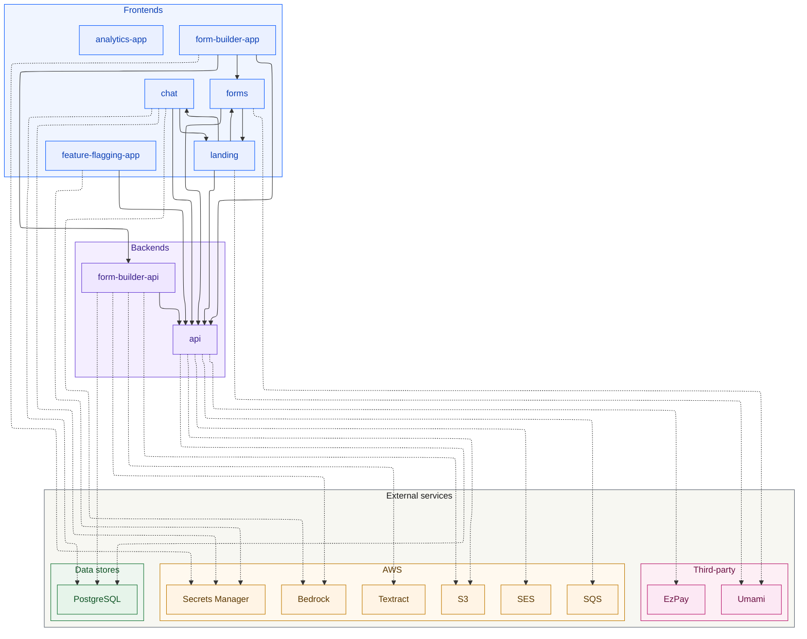

# Simple Service Builder (SSB)

Platform for building and delivering Barbados government digital services —
online forms, a no-code form builder, a services landing site, and an assistant
chatbot.

> The npm/monorepo package is still named `@govtech-bb/modular-forms-monorepo`
> for historical reasons; the product is **SSB**.

## Prerequisites

- Node.js >= 20
- pnpm 11 (`corepack enable`, pinned to `pnpm@11.6.0` via `packageManager`)

## Getting started

```bash
pnpm install
```

## Project structure

This is an **nx + TypeScript project-references monorepo** using pnpm workspaces.

```
apps/
  api/               NestJS backend — forms, recipes, submissions, and per-form
                     processors (email, payment, uploads). Postgres via TypeORM.
                     Runs as a container on ECS/Fargate.
  forms/             Citizen-facing form renderer (Vite + React, static site).
                     Deployed on Amplify.
  form_builder/      No-code form-authoring app (SSR, GitHub-OAuth gated).
                     Deployed on Amplify (compute).
  form_builder_api/  Backend for the builder — publishes recipes via git and
                     issues presigned S3 upload URLs. Container on ECS.
  landing/           gov.bb services landing site (TanStack Start SSR).
                     Deployed on Amplify (compute).
  chat/              Assistant chatbot (SSR) plus a RAG ingest task. Uses AWS
                     Bedrock. Amplify (compute) + a Fargate ingest job.

packages/
  form-types/        Shared TypeScript types for forms and recipes.
  registry/          Canonical registry of built-in field & component definitions.
  form-conditions/   Conditional show/hide evaluation.
  form-validation/   Field-level validation rules.
  expressions/       Expression evaluation engine.
  form-builder/      Shared form-builder logic and components.
  database/          TypeORM entities, DB access, and recipe file loaders.
  git-publish/       Publishes recipes to the repo via git commits.
  ai-bedrock/        AWS Bedrock client wrapper.
  analytics/         Analytics event tracking.
  aws-secrets/       AWS Secrets Manager helpers.
  content/           Shared content / markdown loaders.
```

> **Adding a new package?** It must be a buildable nx project *and* be listed in
> the consuming project's `tsconfig.json` `references`, or the strict `tsc`
> build fails with `TS6059`/`TS6307`. See `CLAUDE.md` → "Monorepo build gotcha".

## Architecture

Runtime topology only — apps and the external services they call. Solid arrows
are app-to-app calls (inferred from URL env vars in each app's
`.env.example`); dashed arrows are calls out to AWS, the database, or another
third party (inferred from the workspace dep graph, walked transitively).
Shared workspace packages are omitted on purpose. Regenerate with
`pnpm generate:architecture-diagram`.

<!-- ARCHITECTURE_DIAGRAM_START -->



<!-- ARCHITECTURE_DIAGRAM_END -->

## Scripts

| Command | Description |
|---|---|
| `pnpm build` | Build all apps and packages (`nx run-many -t build`) |
| `pnpm test:all` | Run the full test suite (`nx run-many -t test`) |
| `pnpm lint` | Lint all projects |
| `pnpm lint:deps` | Check workspace dependency consistency (sherif) |
| `pnpm dev:forms` | Start the forms app in dev mode |
| `pnpm dev:api` | Start the API in dev mode |
| `pnpm dev:landing` | Start the landing app in dev mode |
| `pnpm format` / `pnpm format:check` | Format (or check) with Prettier |
| `pnpm validate-recipes` | Validate all recipe files |
| `pnpm dump-recipes` | Dump recipes from the DB to files |
| `pnpm migration:generate -- <path>` | Generate a migration from entity changes |
| `pnpm migration:run` / `:revert` / `:show` | Apply / revert / show migrations |

Other apps run directly via nx, e.g. `pnpm exec nx dev chat`,
`pnpm exec nx dev form-builder-app`, `pnpm exec nx serve form-builder-api`.

> **Local build caveat:** `landing`'s prebuild fetches from a live external
> forms API, so a fully offline build fails on it; `cms` is deprecated. When
> verifying locally, run
> `pnpm exec nx run-many -t build --exclude=landing,cms` and let CI build
> everything. Scope tests to what you touched
> (`pnpm exec nx run-many -t test -p <projects>`) to avoid local OOM.

## Environment variables

Each app ships a `.env.example` — copy it and adjust:

```bash
cp apps/forms/.env.example apps/forms/.env
cp apps/api/.env.example apps/api/.env
```

Key variables:

| Variable | App | Description |
|---|---|---|
| `VITE_API_URL` | forms | API base URL (Vite, build-time) |
| `API_PORT` | api | API server port (default `3001`) |
| `DB_HOST` / `DB_PORT` / `DB_USERNAME` / `DB_PASSWORD` / `DB_NAME` | api | PostgreSQL connection |
| `DB_SYNCHRONIZE` | api | Auto-sync schema — **dev only, never `true` in production** |
| `DB_SSL_CA` | api | Optional CA bundle for verifying the DB TLS cert in production |

## Database

The API uses PostgreSQL via TypeORM. The CLI DataSource is at
`apps/api/typeorm.config.ts`; migrations live in
`apps/api/src/database/migrations/`.

```bash
pnpm migration:generate -- apps/api/src/database/migrations/<MigrationName>
pnpm migration:run
pnpm migration:revert
pnpm migration:show
```

> `DB_SYNCHRONIZE=true` auto-syncs the schema on startup — useful in local dev,
> never in production. Use migrations instead.

> **Note:** at runtime, production forms are served from **recipe files**, not
> the `form_definitions` table (a `NODE_ENV` guard) — so DB changes don't alter
> the live forms list. See `docs/decisions/0007-runtime-recipes-load-from-files…`.

## Deployment & branching

- **Frontends** (`forms`, `landing`, `chat`, `form_builder`) deploy on **AWS
  Amplify** — `forms` as a static site, the others as SSR compute apps.
- **Backends** (`api`, `form_builder_api`) and the **chat RAG ingest** run as
  containers on **ECS/Fargate**.
- Environments: **`sandbox` → `staging` → `prod`**, each tied to its AWS
  environment.

The team is moving to a **trunk-based model** with `main` as the single
CI-gated source of truth (merges to `main` fan out to the environments;
production is a manual, windowed deploy). See
[`docs/trunk-based-development.md`](docs/trunk-based-development.md).

## Path aliases

Shared packages are imported via `@govtech-bb/<name>` (configured in
`tsconfig.base.json`), e.g. `@govtech-bb/form-types`, `@govtech-bb/registry`,
`@govtech-bb/form-conditions`, `@govtech-bb/database`.

## Nx

```bash
pnpm exec nx graph              # Visualize the dependency graph
pnpm exec nx show projects      # List all projects
pnpm exec nx run forms:build    # Build a single project
pnpm exec nx affected -t build  # Build only what changed vs the base branch
```
