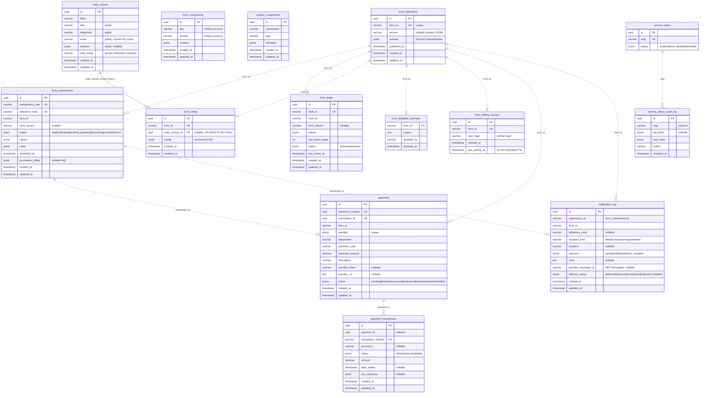

# Database ERD

The database is defined **once** in `@govtech-bb/database`
(`packages/database/src/entities`) and shared by both backends:

- **`apps/api`** (NestJS, TypeORM) — `AppDataSource = createDataSourceFromEnv()`;
  its `src/database/entities/*` are re-export shims over the shared package.
- **`apps/form_builder_api`** (Express, TypeORM) — `getDataSource()` calls the
  same `createDataSourceFromEnv()`.

There is one physical PostgreSQL schema. Migrations live in
`packages/database/src/migrations`.

## Relationships at a glance

Only **one** relationship is a DB-enforced foreign key. Everything else is a
**logical join by value** — the columns hold the key of another row but no
`FOREIGN KEY` constraint is declared (TypeORM entities use plain `@Column`s, not
relations).

| Relationship | Enforced? | Key |
| --- | --- | --- |
| `form_config` → `mda_contact` | ✅ FK, `ON DELETE SET NULL` | `mda_contact_id` → `mda_contact.id` |
| `payments` → `form_submissions` | logical (unique) | `submission_id` |
| `payment_transactions` → `payments` | logical | `payment_id` |
| `notification_log` → `form_submissions` | logical | `submission_id` (stored as varchar) |
| `service_status_audit_log` → `service_status` | logical | `slug` |
| many tables → *a form* | logical | `form_id` (varchar, the recipe id) |

`form_id` is a free-standing string key (the recipe id), not a UUID FK into
`form_definitions`. `form_definitions` is shown below as the logical hub because
it is the canonical row *for* a `form_id`, but a submission/draft can resolve the
committed canonical recipe without a matching DB row.

## Diagram

Solid lines (`──`) are DB-enforced foreign keys. Dashed lines (`- -`) are
logical value joins.

## Table groups

- **Forms / builder** — `form_definitions` (canonical recipe rows),
  `form_components`, `custom_components`, `form_editing_session` (single-editor
  claim), `form_disabled_overrides`.
- **Runtime submissions** — `form_submissions`, `form_drafts`,
  `notification_log`.
- **Payments** — `payments`, `payment_transactions`.
- **MDA config** — `mda_contact`, `form_config`.
- **Service status** — `service_status`, `service_status_audit_log`.

All UUID-keyed tables extend `TimestampedEntity` (`id`, `created_at`,
`updated_at`); `service_status`, `service_status_audit_log`, and
`form_editing_session` extend `UuidEntity` (`id` only). `form_disabled_overrides`
is the one table with no surrogate `id` — its PK is `form_id`.
