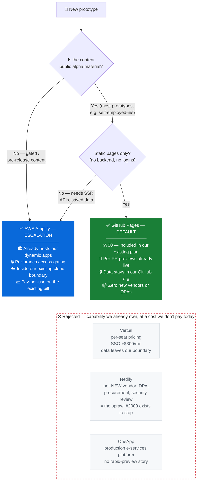
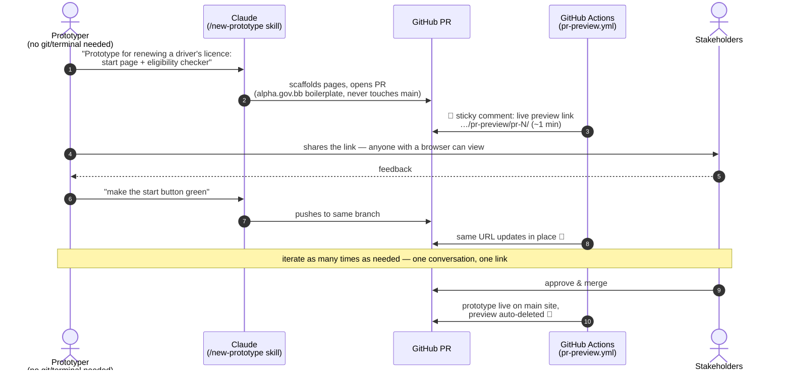

# Standardising Prototype Hosting — Investigation & Recommendation

**Issue:** [#2009](https://github.com/govtech-bb/gov-bb/issues/2009)
**Status:** Draft for review · **Date:** July 2026

---

## 1. Problem

Prototypes currently live across several hosting platforms. Every extra platform is another login, another billing surface, another security review, and another thing that breaks differently. We want **one consistent base** to build the Claude prototyping workflow on, so anyone on the team, technical or not, can go from idea to shareable prototype the same way every time.

## 2. What we assessed

All options named in the issue, plus GitHub Pages (which we already use in production for prototypes and which was missing from the original list):

| Option | Do we already run it? | Notes |
|---|---|---|
| **GitHub Pages** | ✅ Yes | [`self-employed-nis`](https://github.com/govtech-bb/self-employed-nis): live site **and** per-PR previews |
| **AWS Amplify** | ✅ Yes | Existing dynamic web apps already hosted here |
| **Vercel** | ⚠️ Partial footprint | A few scattered prototypes |
| **Netlify** | ❌ No | Floated as a candidate; no existing footprint |
| **OneApp** | ⚠️ Not for prototyping | Production e-services delivery platform, not a rapid-prototyping target |

### Evaluation criteria (from the issue)

Fit with existing stack · developer experience · suitability for the Claude prototyping workflow · security/compliance · operational overhead · cost (recurring + switching).

## 3. Key facts that decided the outcome

1. **We already run per-PR preview deployments on GitHub Pages.** Live proof: <https://govtech-bb.github.io/self-employed-nis/pr-preview/pr-81/check.html>, an isolated preview of an open PR, deployed automatically by `pr-preview.yml`, linked via a sticky bot comment on the PR, and auto-deleted when the PR closes. Per-PR previews are the headline feature of Vercel/Netlify subscriptions; we already have it for $0.
2. **Our GitHub plan supports public Pages sites only.** Private/access-controlled Pages requires GitHub Enterprise Cloud, an org-wide upgrade. This is fine for public alpha content, which is most of what we prototype, but means gated prototypes need a different home.
3. **Amplify already covers the gated/dynamic case.** Server-side rendering and API routes, per-branch access gating, custom domains, all inside our existing cloud accounts with our existing monitoring and one consolidated bill.
4. **Vercel and Netlify both move prototype content outside our existing boundary**: a new (or expanded) vendor relationship, data-processing agreement, and security review, to buy capabilities we already own.

## 4. Cost analysis (July 2026 pricing)

Assumptions: a small prototyping team, 10–15 concurrent low-traffic prototypes.

| | GitHub Pages | AWS Amplify | Vercel | Netlify |
|---|---|---|---|---|
| **Baseline recurring** | **$0** (included in existing plan) | Pay-per-use, low per prototype, consolidated in existing cloud bill | Pro: **$20 per user/month**, grows with every seat | Pro: **$20/month flat**, unlimited members |
| Included bandwidth | 100 GB/mo (soft limit) | Pay-per-GB | 1 TB/mo | ~150 GB/mo (credit system) |
| Overage model | Throttled, not billed | ~$0.15/GB served | $0.15/GB, $0.60/1M invocations, known for surprise bills | ~$0.13/GB via credits |
| **Access control** | ❌ Public only on our plan; private Pages = org-wide Enterprise Cloud upgrade | ✅ Included (per-branch gating) | Password on Pro; **SSO +$300/mo**, Advanced Deployment Protection **+$150/mo** | Password on Pro; RBAC/SSO = Enterprise (custom pricing) |
| **Switching / one-time cost** | None, in use today | None, in use today | Migration of scattered prototypes + expanded vendor review | **Net-new vendor**: procurement, DPA, security review, team onboarding |
| Data stays in our existing boundary | ✅ | ✅ | ❌ | ❌ |

### Cost-benefit summary

- **GitHub Pages**: highest benefit-per-dollar for our dominant prototype type (public, static). $0 incremental, no new vendor, PR previews already built. Limits: public + static only.
- **AWS Amplify**: best fit for the minority Pages can't serve (dynamic, SSR, gated). Already our norm; costs only what prototypes actually use.
- **Vercel**: best raw developer experience, but per-seat pricing scales badly, compliance features are expensive add-ons, and it duplicates what Amplify gives us inside our own boundary. (Note: Vercel's free Hobby tier prohibits organisational use, so Pro is the floor.)
- **Netlify**: cheapest paid external option, but a **net-new vendor** adopted to do what two platforms we already run can do. That is the definition of the sprawl this issue exists to stop.
- **OneApp**: production e-services platform. No rapid-preview story, heavyweight onboarding; wrong tool for throwaway iterative prototypes. *Action: confirm capability/cost with OneApp owners to formally close this line.*

## 5. Recommendation

> **Standardise on GitHub Pages as the default prototype platform, with AWS Amplify as the documented escalation path. Adopt no new platform. Decommission prototype hosting on Vercel and Netlify as prototypes naturally retire or migrate.**

**The routing rule, one sentence, no judgement calls:**

> **Public + static → GitHub Pages. Dynamic or gated → AWS Amplify.**

### Why Pages wins — the decision, as a picture

Every candidate platform answers two questions: **can it host the prototype, and what does saying yes cost us?** The diagram routes every prototype we make and shows where each platform falls out of the running:

Read it as the argument in one glance: **every prototype lands on a platform we already run.** The rejected column isn't "worse tools"; it's tools whose only capabilities are ones the green and blue boxes already give us, bought at the price of a new vendor, a new bill, and data leaving our boundary.

### Why it works for non-technical people — the loop, as a picture

The person building the prototype touches exactly two things: **a Claude conversation and a link to share.** Branches, commits, deploys, and cleanup are all machinery they never see.

Why this satisfies the acceptance criteria:

- **One consistent base for the Claude workflow**: one repo pattern, one PR flow, one preview mechanism; Amplify is a documented exception, not a second workflow.
- **Fits the existing stack**: zero new vendors, zero new DPAs, no prototype content leaving our boundary.
- **Lowest cost of any option**: $0 recurring for the default tier; Amplify usage we already pay.
- **The Netlify-vs-existing-tooling trade-off, answered explicitly**: Netlify's only advantage (cheap flat pricing) does not outweigh being a net-new vendor duplicating owned capability.

## 6. How it works today (the mechanics we standardise on)

The `self-employed-nis` repo is the reference implementation. Two small workflows:

- **`deploy.yml`**: on push to `main`, publishes the site to the root of the `gh-pages` branch (`peaceiris/actions-gh-pages@v4`). Uses `keep_files: true` so production deploys **don't wipe open PR previews**. Copy this setting verbatim.
- **`pr-preview.yml`**: on every PR open/update, deploys that PR's version to `pr-preview/pr-<N>/` (`rossjrw/pr-preview-action@v1`), posts/updates a **sticky comment on the PR with the live link**, and deletes the preview when the PR closes.

The result, from a reviewer's point of view: open the PR, click the bot's link, see the live prototype. No accounts, no CLI, no deploys to understand.

## 7. Rollout plan

### Step 1 — Template repo (~half a day)
Create `govtech-bb/prototype-template` containing:
- The two workflows above (generalised: build/stage step configurable instead of a hard-coded file list)
- alpha.gov.bb design boilerplate (header, footer, "This service is in Alpha" banner, typography)
- A `README` written for non-developers: "click *Use this template*, name your prototype, done"
- The Claude prototyping skill (Step 3)

### Step 2 — Document the standard (~1 hour)
This document, plus the routing rule and an "escalate to Amplify" checklist (needs a backend? needs to be non-public? → Amplify, tag the platform team).

### Step 3 — Claude prototyping skill (~a day, the multiplier)
Everyone on the team already uses Claude, so make Claude the interface to the standard. Ship a skill (e.g. `/new-prototype`) in the template repo that encodes the whole workflow so nobody has to remember it:

**What the skill does when invoked:**
1. Asks in plain English what the prototype is (service name, audience, what the page should do)
2. Scaffolds pages using the alpha.gov.bb boilerplate: correct header/footer/Alpha banner by construction
3. Creates a branch and opens a PR (never commits to `main`; the skill enforces this)
4. Tells the user: *"Your preview link will appear as a comment on the PR in ~1 minute"*
5. On follow-up feedback ("make the start button green", "add a question about NIS numbers"), edits and pushes to the same branch, and the **same preview URL updates in place**
6. Knows the routing rule: if the user asks for logins, saved data, or a private prototype, it stops and routes them to the Amplify escalation path instead of building something Pages can't host

### Step 4 — Step-by-step: a non-technical person ships a prototype

This is the end-state experience the standard buys us. No git, no terminal, no cloud console:

1. **Open Claude** (Claude Code on the web works from a browser, no local setup) and connect it to the prototype repo (or ask Claude to create one from `prototype-template`).
2. **Describe the prototype in plain English**: *"I need a prototype for renewing a driver's licence: a start page, an eligibility checker, and a confirmation page."*
3. **Claude scaffolds it and opens a PR.** The skill handles branch, commit, and PR mechanics invisibly.
4. **Wait ~1 minute.** The preview bot comments on the PR with a live link: `https://govtech-bb.github.io/<repo>/pr-preview/pr-<N>/`
5. **Share that link** with stakeholders, policy leads, user-research participants; anyone with a browser can see it. It's a real URL on real infrastructure.
6. **Iterate by chatting.** Every change Claude pushes updates the *same* link; stakeholders just refresh.
7. **When it's approved**, a reviewer merges the PR. The prototype goes live on the main Pages URL and the preview cleans itself up automatically.

The full loop, idea to live shareable prototype, is one conversation with Claude.

### Step 5 — GitHub + Claude workshop (~2 hours, run once, record it)
Hands-on session for the prototype team:
- **Part 1 (30 min):** the standard and why: the routing rule, the PR-preview loop, a live demo using a real open PR as the example
- **Part 2 (60 min):** everyone builds: each attendee creates a prototype from the template via the Claude skill and gets a live preview URL before the session ends
- **Part 3 (30 min):** review etiquette (comment on the PR, not in DMs), when to escalate to Amplify, where to get help

Success criterion: every attendee leaves having shipped a live, shareable prototype themselves.

## 8. Decisions requested

1. Approve **GitHub Pages (default) + Amplify (escalation)** as the prototype hosting standard.
2. Approve creation of `prototype-template` + the Claude prototyping skill.
3. Schedule the workshop.
4. Agree a wind-down: no *new* prototypes on Vercel/Netlify from the date this is approved; existing ones migrate or retire naturally.

## Appendix — sources

- [Vercel pricing](https://vercel.com/pricing) · [Netlify pricing](https://www.netlify.com/pricing/) · [GitHub Pages limits](https://docs.github.com/en/pages/getting-started-with-github-pages/github-pages-limits) · [Private Pages requires Enterprise Cloud](https://docs.github.com/en/enterprise-cloud@latest/pages/getting-started-with-github-pages/changing-the-visibility-of-your-github-pages-site)
- Reference implementation: [`self-employed-nis` workflows](https://github.com/govtech-bb/self-employed-nis/tree/main/.github/workflows)
- A companion memo with fuller internal cost detail is circulated separately.
