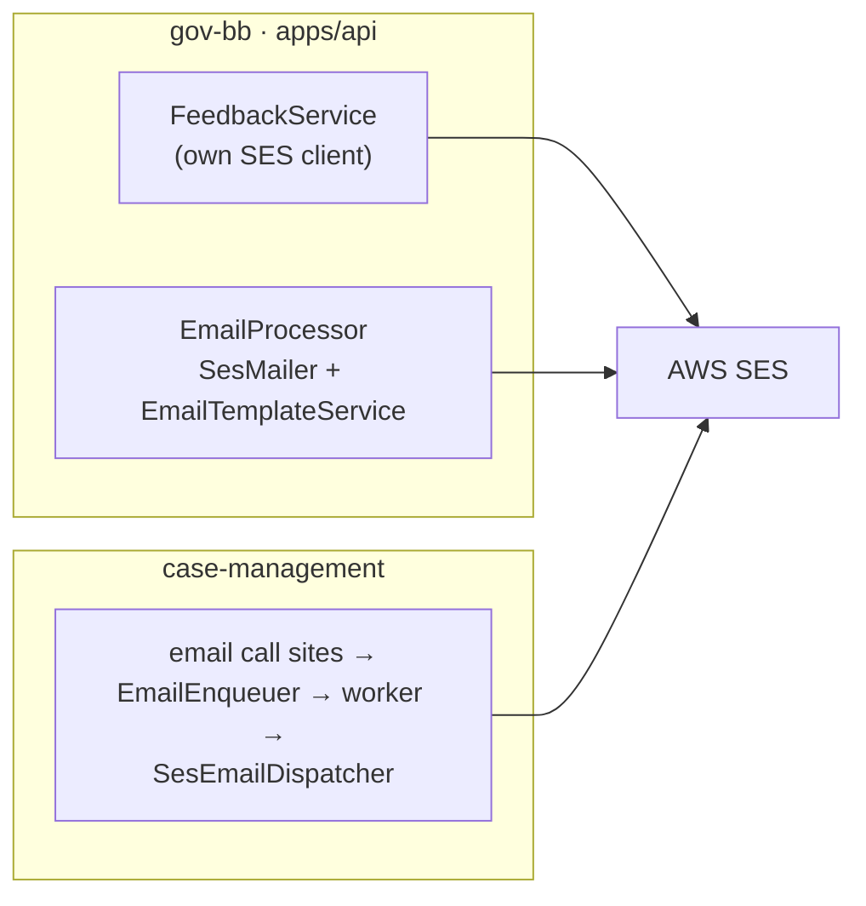
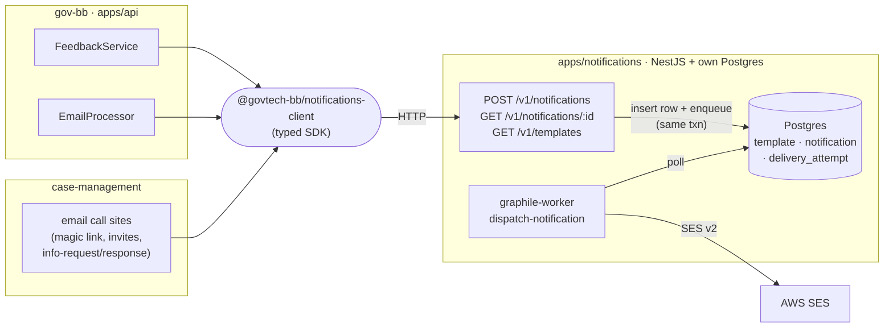
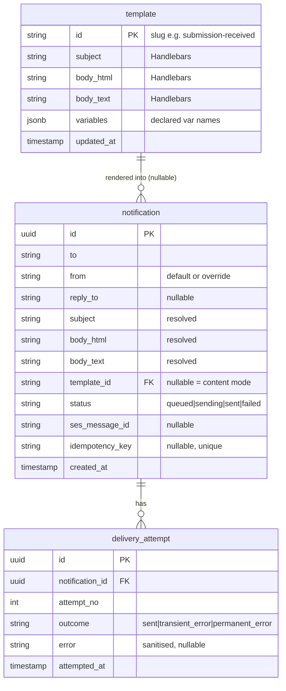
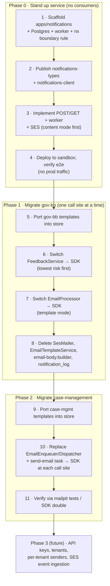

# Notification Service — Design

**Date:** 2026-07-14
**Status:** Design (planning only — no implementation authorised yet)
**Author:** Shannon Clarke
**Scope of this doc:** v1 of a shared Notification Service, plus the staged
migration of gov-bb and case-management onto it. External/multi-tenant
exposure is documented as a future phase, not built in v1.

---

## 1. Motivation

Two separate government products currently send transactional email, and each
has reimplemented the same capability against AWS SES:

- **gov-bb** (`apps/api`, NestJS) — `SesMailer` + `EmailTemplateService`
  (SES v2 SDK, Handlebars templates), **plus a second, independent SES client**
  inside `FeedbackService` that bypasses `SesMailer` entirely.
- **case-management** (Next.js) — an `EmailEnqueuer`/`EmailDispatcher` port pair
  with `SmtpEmailDispatcher` and `SesEmailDispatcher` adapters (nodemailer +
  SES v2), markdown-plus-`marked` templates, dispatched off the request path by
  a graphile-worker job.

That is **three SES integrations across two repos**, three template systems,
and duplicated delivery/retry logic. Both apps independently believe email
should be dispatched asynchronously (gov-bb via SQS, case-management via
graphile-worker), so the *shape* of the solution is already agreed — it just
isn't shared.

A single Notification Service:

- collapses three SES integrations to one, in one place with one IAM posture;
- centralises government email branding (the coat-of-arms layout) in one
  template layer instead of per-app HTML;
- gives one delivery log and one status-lookup surface for ops/audit;
- and — crucially for the longer-term vision — becomes a capability that
  **external MDAs can consume later via API key** without touching SES
  themselves. That external step is explicitly *out of scope for v1* but the
  design keeps the door open for it (see §11).

### Chosen approach: clean-room service ("Approach B")

Three approaches were weighed:

- **A — Reuse gov-bb infra, thin caller boundary.** Reuse `SesMailer`, gov-bb's
  SQS pattern, its `notification_log` entity, etc.; wrap them behind an HTTP
  door.
- **B — Clean-room service, replace the internals (CHOSEN).** The service shares
  *nothing* with the forms domain. Own database, own queue, own minimal SES
  client, own template store. Both apps' existing email code is **deleted**, not
  wrapped; they become pure clients.
- **C — Packages-first, defer the HTTP service.** Ship shared packages, consume
  in-process, stand the service up only when a third consumer appears.

**B was chosen** because it is the only option that produces a genuine shared
*platform service* with zero forms-domain leakage and a clean boundary that a
future external consumer can sit behind. The cost — a bigger, higher-risk
cutover that rebuilds queue + delivery-logging + SES wiring that already works
in gov-bb — is accepted, and mitigated by the staged, reversible migration in
§10 (never a big-bang cutover).

---

## 2. Goals and non-goals

### v1 goals

1. A standalone Notification Service that accepts a send request and dispatches
   email via AWS SES asynchronously.
2. Two ways to specify the message body: a caller-rendered `content` body, or a
   service-stored `template` + variables.
3. A template store with a shared branded layout and per-template variable
   validation.
4. Persistent delivery records with a caller-facing status-lookup endpoint.
5. Idempotent sends via an optional idempotency key.
6. Migrate gov-bb and case-management onto the service, deleting their bespoke
   email code.
7. Two shared npm packages so both stacks share the request/response contract
   and a typed client.

### v1 non-goals (explicitly deferred)

- **Auth / multi-tenancy / API keys.** v1 is consumed only by the two internal
  apps over the trusted internal network. No `x-api-key`, no per-tenant
  isolation. (Deferred to Phase 3 — §11.)
- **SMS / push / any non-email channel.** Email only. (The API shape leaves room
  for a `channel` discriminator later, but v1 ships email.)
- **SES bounce/complaint ingestion & suppression lists.** Log + status lookup
  only; consuming SES delivery events via SNS is Phase 3.
- **Template-authoring UI.** Templates are seeded via migration/seed script in
  v1; a non-developer editing UI is a later increment.
- **Attachment persistence.** Attachments pass through the request and are
  streamed to SES at dispatch; they are not stored.

---

## 3. Architecture and boundaries

A new NestJS app at **`apps/notifications`** in the gov-bb monorepo. It inherits
the monorepo's CI, the sequential deploy fan-out (sandbox → staging → prod), and
the AWS account wiring — but it imports **none** of the forms domain.

- **No forms coupling.** `apps/notifications` must not import `@govtech-bb/form-*`,
  `@govtech-bb/registry`, or the shared `@govtech-bb/database` entity set (those
  are forms/payments/service-status entities). This is enforced by an **nx module
  boundary lint rule**, not just convention.
- **Own Postgres.** A dedicated database with its own connection string / secret,
  separate from the forms database. Entities via **TypeORM** (the monorepo's
  house ORM, so it fits existing build/migration conventions).
- **Own async queue.** **graphile-worker** on that same Postgres — a
  battle-tested DB-backed outbox (already proven in case-management). No SQS, no
  external broker. *(Implementation note: the plan stage may finalise
  graphile-worker vs. a hand-rolled outbox table + poller; graphile-worker is the
  recommendation.)*
- **Own SES client.** A thin, generic SES v2 sender. No `SesMailer`, no
  coat-of-arms baked into code — all branding lives in a template layout.

**Before — three SES integrations across two repos:**

**After — one shared service; neither app talks to SES:**

Neither consuming app talks to SES any more; both go through the service via the
SDK. The `content` vs `template` fork and idempotency handling live inside the
`POST` handler.

### Shared packages (v1: two)

Published to the private registry so **both** the pnpm-nx workspace (gov-bb) and
case-management's plain-npm project can consume them:

| Package | Contents |
|---|---|
| `@govtech-bb/notifications-types` | Zod schemas + inferred TS types for the request/response and template-variable contracts. Single source of truth for the wire format. Depended on by the service and the client. |
| `@govtech-bb/notifications-client` | A tiny typed SDK — `send(...)` and `getStatus(id)` — over `fetch`, depending on `-types`. Both apps import this instead of hand-rolling calls. |

> A third package, **`@govtech-bb/api-key`** (SHA-256 hashing + constant-time
> verification + one-time-plaintext issuance, lifted from case-management's
> implementation and retiring the duplicated `resolveTokenAuth`), was scoped
> during design but is **deferred to Phase 3** since v1 has no auth. It is
> recorded here so the eventual external-exposure work has a known home.

---

## 4. Data model (v1: three tables)

With auth/multi-tenancy deferred, the `tenant` and `api_key` tables are **not**
part of v1, and the remaining tables lose their `tenant_id` scoping.

> Deferred to Phase 3 (external exposure): `tenant` and `api_key` tables, and
> `tenant_id` foreign keys re-added to `template` and `notification`.

### `template`
| Column | Notes |
|---|---|
| `id` | Human slug PK, e.g. `submission-received`. |
| `subject` | Subject line (Handlebars). |
| `body_html` | HTML body template (Handlebars); rendered into the shared layout. |
| `body_text` | Parallel plain-text template for the multipart/alternative text part. |
| `variables` | Declared variable names (string[] / jsonb) used for send-time validation. |
| `updated_at` | Timestamp. |

Templates are **global** in v1 (no tenant scope). Seeded via migration/seed
script.

### `notification`
One row per accepted send — this is the status-lookup record.
| Column | Notes |
|---|---|
| `id` | UUID PK; returned in the `202`. |
| `to` | Recipient address. |
| `from` | Resolved sender (request override or `NOTIFICATIONS_DEFAULT_FROM`). |
| `reply_to` | Optional. |
| `subject` | Resolved subject. |
| `body_html` / `body_text` | Resolved bodies (post-render). |
| `template_id` | Nullable FK → `template` (null for `content`-mode sends). |
| `status` | `queued` → `sending` → `sent` \| `failed`. |
| `ses_message_id` | Set on successful SES send; reconciliation key for future SES-event ingestion. |
| `idempotency_key` | Nullable; **globally unique** when present (per-tenant uniqueness is Phase 3). |
| `created_at` | Timestamp. |

### `delivery_attempt`
One row per SES attempt, for retry visibility/audit.
| Column | Notes |
|---|---|
| `id` | UUID PK. |
| `notification_id` | FK → `notification`. |
| `attempt_no` | 1-based attempt counter. |
| `outcome` | e.g. `sent`, `transient_error`, `permanent_error`. |
| `error` | Sanitised error detail (CWE-117-safe). |
| `attempted_at` | Timestamp. |

### Attachments
Not a table. Passed inline in the request as base64 (`{filename, contentType,
contentBase64}`), capped at **~7 MB** total (matching gov-bb's current SES
raw-MIME budget), and streamed to SES at dispatch. Not persisted — keeps
attachment/PII retention out of the service. Callers needing to send larger
files send a link in the body instead (a future Document Service is the proper
home for large-file handling).

---

## 5. API surface

Three endpoints. **No `x-api-key` in v1** — callers reach the service over the
trusted internal network (VPC / security group), the same posture gov-bb uses
for its own internal backends. `@nestjs/throttler` rate limiting is applied
per-route (matching gov-bb conventions) even without identity.

### `POST /v1/notifications` — send
Request body (validated by `@govtech-bb/notifications-types`):
- `to` (required)
- `from` (optional; defaults to `NOTIFICATIONS_DEFAULT_FROM`)
- `replyTo` (optional)
- `attachments[]` (optional; `{filename, contentType, contentBase64}`, ≤7 MB total)
- **exactly one of:**
  - `content: { subject, html, text? }` — caller-rendered body, or
  - `template: { id, variables }` — service renders the stored template.
- `Idempotency-Key` (optional header).

Responses:
- `202 { id, status: "queued" }` — accepted and enqueued.
- `422` — Zod validation failure; neither or both of `content`/`template`
  supplied; unknown `template.id`; missing declared template variable.

Idempotency: if `Idempotency-Key` is present and a `notification` already exists
for that key, the existing `{ id }` is returned with **no new row and no
re-send**.

### `GET /v1/notifications/:id` — status lookup
Returns the `notification` record (`status`, `sesMessageId`, timestamps) plus its
`delivery_attempt[]`. `404` if the id is unknown.

### `GET /v1/templates` — list (optional, low cost)
Lists available templates (id + declared variables) so callers can discover what
exists. Template **authoring** is out of scope for v1 (seed via
migration/script).

### `GET /health` — unauthenticated, rate-limit-skipped
Matches gov-bb's health-check convention.

---

## 6. Template system

Templates are what earn the service its keep, so v1 includes them.

- **Engine: Handlebars + a shared layout.** gov-bb's existing `.hbs` templates
  port over directly, and Handlebars supports the conditionals/loops those
  templates already use. A single **layout wrapper** holds the government
  branding (coat-of-arms chrome); individual templates render into it, so
  branding lives in exactly one place.
- **Text part.** `body_text` is a parallel plain-text Handlebars template, sent
  as the `multipart/alternative` text alternative.
- **Variable validation.** On send, the supplied `variables` object is validated
  against the template's declared `variables`. A missing required variable is a
  **`422`**, not a silently-empty email — stricter than gov-bb's current
  "render and hope" and case-management's "throw at render time".
- **`content` vs `template` fork.** A caller can always bypass templates and send
  a fully-rendered `content: {subject, html, text}`. This is the **migration
  escape hatch**: an app can move onto the service *before* its templates are
  ported (sending its own rendered body), then switch to `template` mode later
  with no API change.
- **Templates to seed** (ported during each app's cutover, not upfront):
  - gov-bb: `submission-confirmation`, `submission-received`, `payment-required`
  - case-management: `invite`, `magic-link`, `info-request`, `info-response`

---

## 7. Async dispatch pipeline

### Request path (thin)
1. Rate-limit (`@nestjs/throttler`, per-route).
2. If `Idempotency-Key` present and a `notification` exists for it, return that
   id — no new row, no re-send.
3. If `template` mode: resolve the template, validate supplied `variables`
   against its declared set, render `subject`/`html`/`text` (into the layout).
   If `content` mode: use the supplied body as-is.
4. Insert the `notification` row (`status=queued`) **and** `addJob(
   'dispatch-notification', { notificationId })` in the **same Postgres
   transaction**, so a job can never reference a missing row.
5. Return `202 { id }`.

### Worker (`apps/notifications` worker process, graphile-worker)
Runs as its own process/container (like case-management's worker):
1. Picks up `dispatch-notification`, loads the row, sets `status=sending`.
2. Builds the SES v2 message: raw MIME via nodemailer's `MailComposer` when
   attachments are present, otherwise `Content.Simple`.
3. Sends via the SES v2 client; records a `delivery_attempt`.
4. **Success** → `status=sent`, store `sesMessageId`.
   **Failure** → attempt row with sanitised error; graphile-worker retries with
   exponential backoff; after max retries → `status=failed` (terminal; lands in
   graphile-worker's failed-jobs table, the DLQ equivalent).
5. **Retryable vs non-retryable.** Transient failures (SES throttling, 5xx) are
   retried; permanent failures (malformed address, SES validation reject) are
   marked failed immediately so a config error doesn't burn all retries — the
   distinction gov-bb already encodes as `NonRetryableError`.

---

## 8. Error handling and delivery tracking

- **Caller-facing errors** are explicit and early: `422` with the Zod issue set
  for validation, unknown template, or missing template variable. No silent
  fallback to an empty/mis-rendered email.
- **Dispatch failures** never surface to the original caller (the send already
  returned `202`); they are captured on `delivery_attempt` rows and reflected in
  the `notification.status`, discoverable via the status endpoint.
- **Log sanitisation.** Error text stored on `delivery_attempt` is sanitised for
  log-injection (CWE-117), matching gov-bb's `sanitizeForLog` practice.
- **Observability.** Reuse gov-bb's OpenTelemetry conventions: counters for
  sends accepted, sends dispatched, dispatch failures, and template-validation
  failures.
- **`ses_message_id`** is persisted as the reconciliation key so a future
  SES-event (bounce/complaint) consumer (Phase 3) can update records.

---

## 9. Configuration and testing

### Config / env
- `NOTIFICATIONS_DATABASE_URL` — the service's own Postgres.
- `NOTIFICATIONS_DEFAULT_FROM` — default verified SES sender.
- `SES_REGION` / `SES_ENDPOINT` (local override) / `SES_CONFIGURATION_SET`.
- Attachment cap (default ~7 MB) and throttler limits as config.
- Local dev uses an SES-local container (as gov-bb does today) or mailpit-style
  capture; deployed envs use the task-role credential chain (no static creds).

### Testing strategy
- **Unit:** template rendering + variable validation; retryable-vs-non-retryable
  classification; idempotency dedupe.
- **Integration (real Postgres):** POST → row inserted + job enqueued → worker
  dispatches → status transitions to `sent`; idempotent re-POST returns the same
  id with no second send; `422` paths.
- **SES boundary** is faked in tests (a test dispatcher) so tests are fast and
  deterministic — the same reasoning that made email a port in case-management.
- Consuming apps get a **test double of `@govtech-bb/notifications-client`** so
  their suites don't need the live service.

---

## 10. Migration and cutover sequencing

The point of the clean-room approach is that the cutover is **staged and
reversible**, never a big bang. Each step is independently shippable.

Steps 6, 7 and 10 are the risk points; each is a one-line SDK swap behind a
flag/env, and the old path stays in place until its explicit delete step (8, 11),
so any switch can be reverted without a redeploy of the service itself.

### Phase 0 — Stand up the service (no consumers)
1. Scaffold `apps/notifications` (NestJS) + its Postgres + graphile-worker; add
   the nx boundary lint rule.
2. Publish `@govtech-bb/notifications-types` and `@govtech-bb/notifications-client`.
3. Implement `POST /v1/notifications`, `GET /v1/notifications/:id`, the outbox
   worker, and SES dispatch — **`content` mode first** (templates arrive as apps
   migrate).
4. Deploy to sandbox; verify end-to-end with a throwaway caller (send → 202 →
   worker → SES sandbox → status `sent`). **No production traffic yet.**

### Phase 1 — Migrate gov-bb, one call site at a time
5. Port gov-bb's three templates into the store.
6. Switch **`FeedbackService`** first — lowest-risk, self-contained, plain-text,
   single recipient, already a known duplicate SES client. Replace its private
   SES client with an SDK call. Ship; watch delivery logs.
7. Switch the submission **`EmailProcessor`** to the SDK (`template` mode). It
   already runs off gov-bb's own SQS/event listener, so the SDK call slots in
   where `SesMailer` was. Ship.
8. Delete the now-orphaned `SesMailer`, `EmailTemplateService`,
   `email-body.builder` (its body-context building collapses to "assemble
   variables, call SDK"), and the `notification_log` entity/repository. Verify
   build + tests.

### Phase 2 — Migrate case-management
9. Port its four templates into the store.
10. Replace the `EmailEnqueuer`/`EmailDispatcher` ports + both adapters + the
    `send-email` graphile task with an SDK call at each enqueue site (magic link,
    invites, info-request/response). Its worker survives only if non-email jobs
    remain; otherwise it is removed too.
11. Verify with case-management's existing mailpit-based integration tests
    re-pointed, or via the SDK test double.

### Rollback
Each switch (steps 6, 7, 10) is a one-line client swap behind a flag/env —
reverting the call site resumes the old path, which remains present until its
explicit delete step. Deletes (steps 8, 11) happen only after the corresponding
switch has proven stable.

---

## 11. Phase 3 (future, not v1) — external exposure

To make the service consumable by external MDAs "via API key" (the original
long-term vision):

- Re-introduce **`tenant`** and **`api_key`** tables; re-scope `template`,
  `notification`, and `idempotency_key` per tenant.
- Build/publish **`@govtech-bb/api-key`** (SHA-256, constant-time verify,
  one-time issuance) and gate `POST`/`GET` behind `x-api-key` → tenant.
- Per-tenant verified sender identities/domains and usage quotas.
- Optional: SES bounce/complaint ingestion via SNS + suppression lists;
  template-authoring UI; a `channel` discriminator for SMS/push.

None of this is built in v1; the v1 schema and API are intentionally shaped so
these are additive, not rewrites.

---

## 12. Risks and open questions

- **Two production email paths change during migration.** Mitigated by the
  staged, flag-gated, reversible sequencing in §10 and by switching gov-bb's
  low-risk `FeedbackService` first.
- **Forms-domain leakage into the "clean-room" service.** Mitigated by the nx
  boundary lint rule and by not depending on `@govtech-bb/database`.
- **graphile-worker vs hand-rolled outbox** — deferred to the plan stage;
  graphile-worker recommended.
- **ORM/migration mechanics for a second Postgres in the monorepo** — confirm the
  TypeORM datasource/migration wiring for a DB separate from the forms DB at the
  plan stage.
- **Local email capture** (SES-local vs mailpit) for `apps/notifications` — pick
  at the plan stage to match the existing local full-stack recipe.
