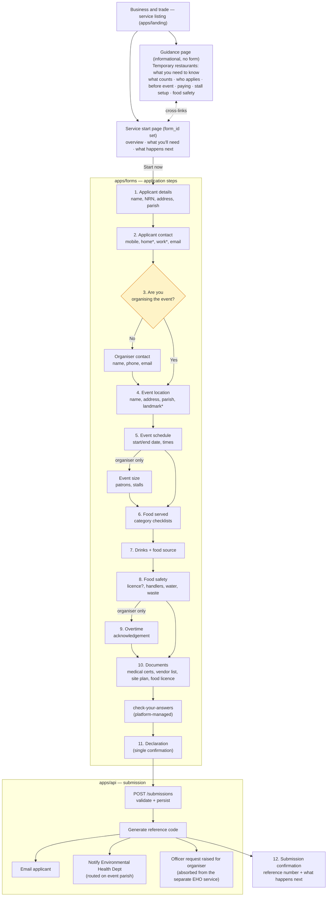
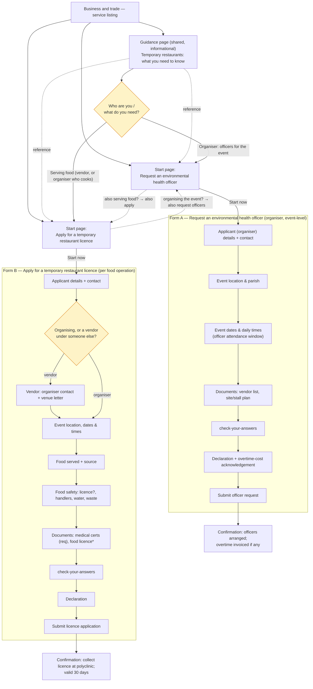

# Temporary Restaurant Licence — integration plan

**Date:** 2026-07-22
**Prototype:** https://govtech-bb.github.io/newforms/Prototypes/temporary-restaurant-licence.html
**Owning MDA:** Ministry of Health and Wellness — Environmental Health Department
**Target form id:** `apply-for-temporary-restaurant-licence`

> Scope decisions (agreed at brainstorming):
> - **Geo-routing:** parish-based (MVP). Drop the interactive Leaflet map; capture event address + parish + landmark as fields and route on parish server-side.
> - **Food selector:** per-category "select all that apply" multi-selects (MVP). Drop the accordion + dynamic higher-risk logic.
> - **This document is a plan only.** No recipe JSON or app code is written yet.

---

## 1. What the prototype is

A licence application run by the Environmental Health Department for anyone serving food/drink at a temporary event (a "temporary restaurant"). Both the event **organiser** and each **food vendor** apply. The prototype is a client-side SPA with 10 screens; the organiser-vs-vendor answer drives most of the conditional behaviour.

Prototype screens: `start` (guidance) → `applicant-details` → `organiser` → `event-details` → `food-details` → `food-safety` → `documents` → `check` → `declaration` → `confirmation`.

## 2. How the platform works (the three apps)

Recipe-driven DSL. Recipes are **thin**: each field is a `ref` into the shared registry (`packages/registry`) plus an `overrides` patch, validated against `serviceContractRecipeSchema` (`packages/form-types`). The API hydrates a recipe into a served contract; `apps/forms` renders it; `apps/landing` hosts the guidance page and links out.

| App | Responsibility for this form | Key location |
|---|---|---|
| `apps/api` | The recipe file + submission handling, reference code, email/routing processors | `apps/api/src/forms/form-definitions/recipes/*.json` (flat, filename = `formId`) |
| `apps/forms` | Renders each step/field via `switch(htmlType)` | `apps/forms/src/components/field-renderer/index.tsx` |
| `apps/landing` | The `start`/guidance page + "Start now" link | `apps/landing/src/content/<slug>/index.md` |

**No `apps/forms` code change is required** for the MVP — every field maps to an existing `htmlType` (`text, textarea, number, date, tel, email, checkbox, radio, file, select, show-hide`). A map or accordion would each need a brand-new `htmlType` + renderer, which the MVP avoids.

## 3. Work item A — `apps/landing` (two pages, both under *Business and trade*)

There are **two distinct landing pages**, of two different types, both categorised *Business and trade*:

### 3.1 Guidance page (informational — no form)

`apps/landing/src/content/temporary-restaurants-what-you-need-to-know/index.md`. This is the prototype's `temporary-restaurant-guidance.html` — a static reference page with **no `form_id`** and **no Start button**. Sections: *What counts as a temporary restaurant* (incl. the 1969 Regulations legal definitions), *Who needs to apply*, *Before your event*, *Paying for environmental health officers*, *Setting up your stall*, *Keeping food safe*, *Contact us*. It is the "opens in a new tab" reference the service links out to.

### 3.2 Service start page (transactional — the form)

`apps/landing/src/content/apply-for-temporary-restaurant-licence/index.md`.

- Frontmatter: `form_id: apply-for-temporary-restaurant-licence`, `title`, `description`, `stage: alpha`, `category: Business and trade`, `service_type`, `publish_date`.
- Body carries the prototype's `start` content: *Who needs a licence*, *When to apply and what it costs* (apply ≥14 days ahead; no application fee; organiser pays officer overtime), *What you'll need*, *What happens next* — with in-body links to the guidance page's section anchors (`#what-counts`, `#paying`, `#setting-up-your-stall`).
- A `<a data-start-link>Start now</a>` anchor. A remark plugin bakes `form_id` onto it; `StartLink.tsx` resolves the href to `${VITE_FORMS_URL}/forms/apply-for-temporary-restaurant-licence`.
- The Start button stays **suppressed until the form is `public`** and appears in the live `/form-definitions` list — so the recipe must be published for the link to activate.

The guidance page and the start page **cross-link**: the start page's body points into the guidance sections; the guidance page's *Contact us* / *Paying* sections point back to the service (and, if built, to the separate officer-request service — see §5/§9).

## 4. Work item B — the recipe (`apps/api`)

File: `apps/api/src/forms/form-definitions/recipes/apply-for-temporary-restaurant-licence.json`, conforming to `serviceContractRecipeSchema` (filename must equal `formId`). `meta.visibility: "draft"` initially (Rule 18); flip to `public` to launch.

### 4.1 Step plan

The prototype's `applicant-details`, `event-details` and `food-details` each exceed the 8–10-field ceiling (Rule 10), so they split. `check` and the review are the platform-managed `check-your-answers` step (Rule 15 — not authored). Prototype `confirmation` becomes `submission-confirmation` (Rule 6).

| # | Recipe step (`stepId`) | Source screen | Fields (component ref) |
|---|---|---|---|
| 1 | `applicant-details` | applicant-details | first-name, middle-name*, last-name; national-id-number (NRN); address ×2 (line 2*); **parish** (fieldId `applicant-parish`) |
| 2 | `applicant-contact` | applicant-details | mobile-telephone (req), home-telephone*, work-telephone*, email |
| 3 | `organiser` | organiser | generic-radio `is-organiser` (Yes/No). If **No** → name, tel, email of organiser (conditional). If **Yes** → responsibilities note in step `description` |
| 4 | `event-location` | event-details | generic-text `event-name`; address ×2; **parish** (fieldId `event-parish`); generic-text `event-landmark`* |
| 5 | `event-schedule` | event-details | generic-date `event-from`; generic-date `event-to`; generic-text `event-start-time`, `event-end-time`; (organiser-only) generic-number `num-patrons`, `num-stalls` |
| 6 | `food-served` | food-details | generic-checkbox ×8 food categories (higher-risk noted in label) |
| 7 | `food-source-and-drinks` | food-details | generic-checkbox `drinks`; additional-details `food-source` |
| 8 | `food-safety` | food-safety | generic-radio `has-food-licence`; generic-number `handlers-male`, `handlers-female`; generic-text `water-source`, `handwashing`, `waste-disposal` |
| 9 | `organiser-responsibilities` | (declaration) | components/confirmation `overtime-acknowledged` — **shown only when organiser** (moved off the declaration step, see §4.3) |
| 10 | `documents` | documents | upload-document `medical-certs` (req); `vendor-list` (organiser-only, req); `organiser-letter` (vendor-only — letter confirming you can operate; see §5 gap); `site-plan` (req, optional when not organiser); `food-licence`* |
| — | `check-your-answers` | check | platform-managed — **not authored** (Rule 15) |
| 11 | `declaration` | declaration | components/confirmation `declaration-confirmed` — exactly one element (Rule 17) |
| 12 | `submission-confirmation` | confirmation | `elements: []` + `markdownContent` "What happens next" |

\* optional field — omit the `required` validation.

### 4.2 Conditional logic

- `is-organiser` (step 3) is the hub. `"Yes"` reveals `num-patrons`/`num-stalls` (step 5), the `vendor-list` upload (step 10), and `overtime-acknowledged` (step 9), and makes `site-plan` required. `"No"` reveals the organiser's contact fields (step 3).
- Reveal-when-yes fields use `fieldConditionalOn` (`operator: equal`, `value: "yes"`; add `targetStepId` since they live on later steps).
- `site-plan` stays visible always but required only for organisers: mark it `required` + add `optionalIf` (`is-organiser` `equal` `"no"`).
- `event-to` must be on/after `event-from`: `onOrAfter` with `referenceFieldId: event-from`, `referenceStepId: event-schedule`.

### 4.3 Guardrail adaptations (where the prototype and the DSL disagree)

1. **Two declaration checkboxes → one.** Rule 17 caps the declaration step at a single element. The organiser overtime acknowledgement becomes its own `components/confirmation` on a preceding step (`organiser-responsibilities`, step 9), conditional on `is-organiser = yes`.
2. **Radio with exactly 2 options** (`is-organiser`, `has-food-licence`) → `generic-radio` is correct (Rule 8).
3. **Parish reused twice** (applicant + event) → each use gets a distinct `fieldId` (`applicant-parish`, `event-parish`); never override its `options` (ships centrally).
4. **NRN** → `components/national-id-number` (text; never a number input — Rule 9b), label "National Registration Number".
5. **Reference code prefix.** Prototype shows `EH-TR-…`; the platform derives the prefix from `formId` initials unless a processor sets `opts.prefix`. Cosmetic — accept the derived prefix for MVP or set an explicit prefix later.

### 4.4 Processors & routing

- **Email to applicant** (Rule 5, required): `{ type: "email", config: { recipientField: "applicant-contact.email", subject: "Your temporary restaurant licence application" } }`.
- **Copy to the department:** MVP routes to a single Environmental Health inbox via `contactDetails.email` (+ a second email processor). Per-parish routing to the specific polyclinic is **not modelled** in MVP (was the map's job) — noted as a follow-up.
- **No payment processor.** The prototype has no application fee; officer overtime is handled offline.
- `contactDetails`: `{ title: "Ministry of Health and Wellness", telephoneNumber: "1 (246) 536-3800", email: "info@health.gov.bb", address: "Frank Walcott Building, Culloden Road, St. Michael" }`.

## 5. Deliberate MVP simplifications (fidelity gaps)

| Prototype feature | MVP treatment | Follow-up to reach full fidelity |
|---|---|---|
| Leaflet map, pin-drop, polyclinic **zone routing** | Parish + landmark as text; route on parish | New `map` `htmlType` + renderer + zone lookup; dynamic per-polyclinic routing |
| Parish-dependent **landmark dropdown** | Free-text landmark | Cascading-select support |
| Accordion food selector + **higher-risk** tagging | Per-category `generic-checkbox` groups; higher-risk noted in labels | Nested-checkbox/accordion `htmlType`; risk-driven inspection logic |
| **14-days-before-event** validation | `futureOrToday` only; 14-day buffer enforced operationally | No "days-until" validation exists today; add a rule or transform |
| **Time** inputs ("4:00pm") | `generic-text` (no `time` htmlType) | Add a `time` htmlType or structured time field |
| **Dynamic confirmation** (assigned polyclinic, contact, inspection/officer notes) | Static `markdownContent` "what happens next" | Templated confirmation from routing result |
| Male/female food-handler split | Kept as two numbers | Prototype flags this as "under review" — confirm with MDA |
| **Vendor's letter** confirming they can operate | Add a vendor-only `organiser-letter` upload (`fieldConditionalOn is-organiser = no`) — the prototype's `start` page/guidance require it but its `documents` step omits it | Confirm requirement with MDA |

## 6. Verification (when the recipe is later built)

```bash
cd apps/api && npx jest recipe-invariants      # schema + filename/formId invariants
pnpm exec nx run-many -t build --exclude=landing
```

## 7. Open questions for the service owner

1. Confirm the department inbox(es) for routed submissions, and whether per-parish/polyclinic routing is required at launch or can wait.
2. Confirm the male/female food-handler split (prototype marks it "under review").
3. Is the 14-day lead time a hard validation or advisory?
4. Reference-code prefix — is `EH-TR` a requirement or cosmetic?

## 8. Form flow (mermaid)



**Conditional fields (`is-organiser`)** are shown dashed/branch above: organiser contact + vendor's letter (No branch); event size, overtime acknowledgement, vendor-list upload, and required site plan (Yes branch).

## 9. Can one form fulfil the flow?

**Short answer: yes — a single recipe can carry this service — but with three caveats the service owner must accept.**

The flow serves two roles (guidance §*Who needs to apply*: *both the event organiser and each food vendor must apply*). The prototype already collapses both into one form gated on `is-organiser`, and the DSL expresses that split natively (`fieldConditionalOn`, `optionalIf`, `stepConditionalOn`). Each **submission is one applicant in one role for one stall/event**, so nothing about the data model needs two recipes. On that basis, one form works.

The caveats:

1. **It's "two forms in a trench-coat."** The organiser and vendor journeys share only the applicant + event-location + food blocks; everything else diverges (event size, site plan, vendor list, officer request, overtime liability vs. organiser contact + letter of permission). One recipe is fine *today* because the overlap is large, but if the two roles diverge further, splitting into `…-organiser` and `…-vendor` recipes becomes cleaner. Revisit if the conditional count grows.
2. **The form silently performs a second service.** For organisers it *is* the "Request an environmental health officer" service (the officer request is raised on submit — node `OFF` above). That is only correct if the service team designates the licence form as the canonical home for the officer request. This is the unresolved three-way overlap from the two EHO prototypes — it must be settled before build, or the officer request should be its own recipe.
3. **The *flow* is bigger than the *form*.** The informational requirements (legal definitions, stall-setup rules, food-safety rules, payment mechanics) live on the **guidance page**, not the form. So "one form" fulfils the *transaction*; the guidance page fulfils the *understanding*. Both pages are required for the service to be usable — the form alone does not fulfil the flow.

Two concrete correctness gaps to close versus the prototype/guidance (neither blocks the single-form approach):
- The vendor's **letter confirming they can operate** is required by the guidance but missing from the prototype's `documents` step — add it as a vendor-only upload (§4.1 step 10, §5).
- The **14-day lead time** and **time-of-day** inputs have no native DSL rule/type (§5) — accept operationally or extend the DSL.

## 10. Alternative arrangement — two separate forms

This resolves caveat 2 (§9) by making the officer request and the licence **two independent recipes**, both under *Business and trade*, sharing the one guidance page. It matches the *redirect* EHO prototype (`…request.html`).

**What moves where when split:**

| Concern | Single-form (§4) | Two-form split |
|---|---|---|
| Officer attendance request | Absorbed into the licence form for organisers | **EHO form** owns it outright |
| Overtime-cost acknowledgement | Conditional step in licence form | **EHO form** declaration |
| Vendor list, site/stall plan (event-level) | Licence form, organiser-only | **EHO form** (organiser is the only submitter) |
| Food served, food safety, medical certs | Licence form | **Licence form** only |
| `is-organiser` branching | Hub of the whole form | Only in the licence form, and only to tell an organiser-who-cooks from a vendor (venue letter) |
| An organiser who also serves food | One submission | **Two submissions** — one per form (start pages cross-link) |

Recipes: `request-environmental-health-officer.json` + `apply-for-temporary-restaurant-licence.json`. Each still needs its own email processor, declaration step (Rule 17) and `submission-confirmation`.



## 11. Challenge — conditional destination email (parish → polyclinic routing)

The application must reach the Environmental Health Department for the **event's parish**, so the MDA destination depends on a *submitted answer*, not a single fixed per-form address. The "one fixed destination per MDA" assumption is real but **narrower than it looks** — it is only the `config.*` recipient kind.

**How recipient resolution actually works** (`email.processor.ts`, `recipient-field.ts`):
`recipientField` is classified into `literal` (contains `@`) / `contact` (`contactDetails.email`) / `config` (`config.*` → `resolveMdaEmail(formId)`, DB `mda_contact`, **keyed by formId only — cannot branch**) / `submitted` (`stepId.fieldId`). The fixed-per-MDA path is `config.*`.

**But the pipeline already supports field-driven resolution:** `recipientField` is declared `dynamic()` (`processor.type.ts:54`), and the listener resolves every processor's config through `expressions.resolveProcessors(payload.processors, { values })` **before dispatch** (`submission-processor.listener.ts:32`) — the same JSONLogic machinery payment uses for variable amounts. A `dynamic()` expression that reads `event-location.event-parish` and resolves to an address is therefore evaluated at submission; if it resolves to a literal `@` string, `classifyRecipientField` returns `literal` and it is used verbatim. So conditional routing is expressible; the real decision is **where the parish→address table lives.**

| Option | Code change | Where addresses live | Trade-offs |
|---|---|---|---|
| **A — `dynamic()` recipientField in the recipe** | None | 11 literal emails in the committed recipe (JSONLogic map on `event-parish`) | Ships now, zero platform work. But bakes real MDA addresses into git (against the `config.*` design intent), not rotatable without a recipe redeploy, and no sandbox-safe default — sandbox would email real polyclinics unless guarded. |
| **B — routing-keyed DB directory (proper fix)** | Yes | DB `mda_contact` keyed by (formId + routing key), routing key derived from submitted parish | Addresses stay in DB (rotatable, out of git, sandbox default preserved); reusable by any parish-routed form. Needs: feed the discriminator into config resolution, `resolveMdaEmail(formId, key)`, keyed schema + data for 11 polyclinics. |
| **C — single inbox now, route downstream (MVP)** | None | One central Environmental Health inbox via `config.*` | Zero platform work, no addresses in git, safe. Parish is surfaced in the MDA email; the department forwards internally. Manual triage step. |

**Recommendation:** **C to launch** (matches the MVP framing in §5 — parish captured, routing done by people), with **B as the follow-up** once per-polyclinic auto-delivery is wanted. Avoid A committing real addresses to the repo. All three still need the **parish→polyclinic mapping** as domain data from the MDA, plus the applicant confirmation email (a `submitted` recipient — always fine).

## 12. Option B sketch — field-driven MDA routing

Goal: the department notification goes to the polyclinic that serves the **submitted event parish**.

### 12.0 Precedent + verified facts

The platform **already does conditional destination email in production**: the textbook-grant recipe routes to a school inbox with

```json
"recipientField": { "schoolEmail": { "var": "values.child-details.0.child-school" } }
```

`schoolEmail` (`packages/expressions/src/operations/school-email.ts`) is a custom JSONLogic op backed by a lookup map `SCHOOL_EMAILS` (+ `SCHOOL_EMAIL_FALLBACK`) in `@govtech-bb/registry`. Verified facts that shape the sketch:

- `var`/`cat` are json-logic-js built-ins; `registerOperations` only *adds* ops (age/today/daysBetween/currency/schoolEmail), so built-ins survive.
- **`var` paths are rooted at the whole `ResolutionContext`** — submitted answers live under `values.` (e.g. `values.event-location.event-parish`), meta under `meta.`.
- The op must **always return a non-empty string** — `resolveProcessors` validates the whole processor batch, so an empty recipient would drop *every* email on the submission (including the applicant confirmation). `schoolEmail` guarantees this via its fallback.
- `SCHOOL_EMAILS` holds **real addresses committed to git with no environment split**, so that op emails real recipients from any environment (sandbox included).

This gives **two flavours of B**. B1 mirrors the shipped `schoolEmail` pattern (fastest, consistent); B2 is the DB directory (addresses out of git, rotatable, sandbox-safe) for when that matters.

> **Decision (updated):** each polyclinic has its own inbox **and a CMS routing code that the CMS generates** (§13). CMS-generated codes are **environment-specific** (sandbox CMS ≠ prod CMS) and externally owned, so they cannot live in a git-committed registry map. Because the email address and the CMS code should be defined **once** per polyclinic, the shared directory must be **per-environment DB config → choose B2**, extended to hold both `mda_email` and a `cms_routing_code`. B1 is therefore **not** used here (it can't carry env-specific CMS codes). The parish→polyclinic *structure* is stable and can be seeded; the *values* (email, code) are operational, per-environment data.

### 12.1 B1 — registry-map op (mirror `schoolEmail`) — NOT chosen here

> Retained for reference. **Not used for this form** — see the §12.0 decision: CMS-generated, environment-specific codes force a DB directory (B2), and email must share that home. B1 remains valid for a form that only needs *email* routing with addresses that are acceptable in git.


Three small additions, no DB work:

1. **Map** in `@govtech-bb/registry` — `POLYCLINIC_EMAILS` (parish value → serving polyclinic inbox) + `POLYCLINIC_EMAIL_FALLBACK` (a central EHD inbox). Several parishes can point at one polyclinic.
2. **Op** in `packages/expressions/src/operations/polyclinic-email.ts`, mirroring `school-email.ts`, registered in `register.ts`:
   ```ts
   export function polyclinicEmail(key: unknown): string {
     return POLYCLINIC_EMAILS[String(key)] ?? POLYCLINIC_EMAIL_FALLBACK;
   }
   ```
3. **Recipe** — the MDA email processor's `recipientField`:
   ```json
   { "type": "email", "config": {
       "recipientField": { "polyclinicEmail": { "var": "values.event-location.event-parish" } },
       "subject": "New temporary restaurant licence application" } }
   ```

- **Pros:** ~15 lines + a map + one registration; exactly matches a sanctioned, tested pattern; guaranteed fallback; no schema/migration/token plumbing.
- **Cons:** addresses live in a package in git (better than Option A's *inline-in-recipe*, but still committed); rotating an address = package change + deploy; **no environment split** — like `schoolEmail`, a real sandbox submission would email the real polyclinic. Mitigations: point `POLYCLINIC_EMAILS` at a test inbox in non-prod builds, or gate on env — worth deciding explicitly.

### 12.2 B2 — routing-keyed DB directory (when addresses must stay out of git)

Extends the existing `config.*` path so the recipe forwards the parish as a **routing key** and the DB resolves `(formId, routingKey) → polyclinic address`. No addresses or parish→polyclinic logic in the recipe.

#### 12.2.1 Data model

Reuse `mda_contact` as the **per-polyclinic directory** — one row per polyclinic — and add a `cms_routing_code` column so each row carries **both** the inbox and the CMS code (§13). Both are per-environment (sandbox rows hold sandbox-CMS codes / test inboxes; prod rows hold the real ones). Add one join table mapping a form's routing keys to those contacts; keep `form_config`'s single contact as the catch-all default.

```
mda_contact  (existing, + one column)
  ...
  mda_email          varchar(255)   -- the polyclinic inbox (existing)
  cms_routing_code   varchar(100)   -- NEW, nullable: CMS-generated routing code

form_mda_route  (new)
  id             uuid pk
  form_id        varchar(100)     -- the recipe's formId
  routing_key    varchar(100)     -- the parish value, e.g. "st-michael"
  mda_contact_id uuid             -- FK → mda_contact.id, ON DELETE SET NULL
  UNIQUE (form_id, routing_key)
```

Leaving `form_config`'s `UNIQUE(form_id)` + single `mda_contact_id` untouched means the default-inbox fallback and all existing forms keep working unchanged. One directory row per polyclinic means the email address and CMS code are defined exactly once.

#### 12.2.2 Service — `resolveMdaEmail(formId, routingKey?)`

Add an optional routing key with a **fallback chain** (route → form default → miss), preserving today's null-miss semantics that the processor already handles:

```ts
async resolveMdaEmail(formId: string, routingKey?: string): Promise<string | null> {
  if (routingKey) {
    const route = await this.routeRepo.findOne({ where: { formId, routingKey } });
    const email = route?.mdaContactId
      ? (await this.mdaContactRepo.findOne({ where: { id: route.mdaContactId } }))?.mdaEmail
      : undefined;
    if (email) return email;
    // fall through to the form default on an unknown/blank routing key
  }
  return this.resolveMdaEmailDefault(formId); // = today's formId→form_config→contact
}
```

A parallel `resolveCmsRoutingCode(formId, routingKey)` reads `cms_routing_code` off the same route→contact lookup — one directory, two getters — used by the webhook processor (§13.1).

#### 12.2.3 Recipient-token plumbing (`email.processor.ts` + `recipient-field.ts`)

`config.` stays the `config` kind; the suffix after it becomes the routing key (empty suffix = today's behaviour). `resolveConfigRecipient` passes it through:

```ts
const routingKey = recipientField.slice(CONFIG_RECIPIENT_PREFIX.length) || undefined;
const mdaEmail = await this.formConfigService.resolveMdaEmail(payload.formId, routingKey);
```

The prod `MDA_REQUIRE_RECIPIENT` guard and the non-prod default-inbox fallback (the summer-camp incident fix) are unchanged — an unresolved route degrades exactly as an unresolved `config.mdaEmail` does today.

#### 12.2.4 Recipe authoring (the only recipe-side change)

The MDA email processor's `recipientField` is a `dynamic()` JSONLogic expression that concatenates the token prefix with the submitted parish. The parish→polyclinic mapping is **not** here — it's in `form_mda_route`.

```json
{
  "type": "email",
  "config": {
    "recipientField": { "cat": ["config.", { "var": "values.event-location.event-parish" }] },
    "subject": "New temporary restaurant licence application"
  }
}
```

At submission this resolves to e.g. `config.st-michael` → `config` kind → `resolveMdaEmail(formId, "st-michael")`. (Confirm `cat` is registered in `@govtech-bb/expressions`; `var` is standard json-logic-js.) The applicant confirmation stays a separate `submitted` processor (`applicant-contact.email`).

#### 12.2.5 Migration + seed data (per environment)

- Migration creates `form_mda_route` (+ unique index + FK).
- Seed the polyclinic `mda_contact` rows and the 11 parish→contact `form_mda_route` rows **in production only**; sandbox gets none, so it falls back to the default test inbox automatically. Requires the Ministry's parish→polyclinic mapping + each polyclinic inbox.

#### 12.2.6 Tests

- `classifyRecipientField("config.st-michael") === "config"`; empty suffix still resolves the default.
- `resolveMdaEmail(formId, key)`: route hit → polyclinic; unknown key → form default → null.
- Integration: submit with each parish → correct inbox; blank/unknown parish → default; sandbox (no rows) → test inbox.

#### 12.2.7 Effort & reuse

~1 table + migration, ~30 lines of service, ~10 lines in the processor, seed data, and tests — a few days including gathering the address data. It is **form-agnostic**: any parish/region-routed service reuses the same `config.<key>` convention and its own `form_mda_route` rows.

## 13. Challenge — the webhook `mapping.programmeCode` is static

Applies only **if this form also pushes to the external case-management system** via a `webhook` processor (as the summer-camp recipe does). If so, the per-submission polyclinic must reach the downstream system, but `programmeCode` cannot carry it the way it does for the summer camp.

**Why `programmeCode` can't just be made dynamic:**
- `webhookMappingSchema.programmeCode` is `z.string().min(1)` — a **plain literal**. The schema comment is explicit: *"These describe routing, not values, so they are plain literals (no dynamic()): author == resolved."* A JSONLogic object there fails author-time validation.
- `resolveConfig` evaluates only the **direct** fields of `config` — *"No recursion into nested containers."* `mapping` is nested, so nothing inside it is ever resolved (unlike the email `recipientField`, which is top-level). This is why the email trick doesn't transfer.
- `buildMappedCasePayload` (`webhook-mapping.ts`) copies `mapping.programmeCode` verbatim into `programme_code`.

**What already works:** `mapping.applicant.name/email/phone` are `"stepId.fieldId"` **paths** resolved from submitted values at build time (`readPath`). And `event-parish` is a normal field, so it is **already present in the payload's `form_data`** unless excluded.

**Decision (confirmed):** this form **uses the webhook**, and `programme_code` is the value the **CMS routes on**. Because routing must be per-polyclinic, `programme_code` has to vary by the submitted event parish — a static value cannot route. So the routing code must be resolved **per submission**.

| Option | Code change | Approach |
|---|---|---|
| ~~W-A — static code, route downstream~~ | None | **Ruled out** — the CMS routes on `programme_code` itself, so a static value sends every parish to one queue. (Would only work if the CMS could route on a `form_data` field instead.) |
| **W-B — per-submission routing code (chosen)** | Small | Resolve `programme_code` at build time from the submitted parish. See §13.1. |
| W-C — make `mapping` fields `dynamic()` | Larger | Recurse `resolveConfig` into `mapping`. The schema comment deliberately avoided this; broad blast radius. Not chosen. |

### 13.1 Chosen approach (W-B)

The CMS **generates** each polyclinic's routing code, so the platform cannot derive it from the parish — it must look it up. `mapping` is **not** run through `resolveConfig`, so this cannot be a recipe-side JSONLogic expression either — it is resolved inside the webhook processor at build time, where submission `values` are available (the same place `applicant.*` paths already resolve via `readPath`), reading the code from the **shared DB directory** (§12 B2 `mda_contact.cms_routing_code`).

1. **One directory, two getters** — the §12.2.1 `mda_contact` row per polyclinic carries both `mda_email` and `cms_routing_code`; `resolveMdaEmail` and `resolveCmsRoutingCode` read the same route→contact lookup. Defined once, per environment.
2. **`webhookMappingSchema`** — add optional `routingCodeField` (a `"stepId.fieldId"` path naming the field to route on). Keep `programmeCode` as the static form identifier / fallback. Backward compatible: the summer-camp recipe keeps its static `programmeCode` and sets no `routingCodeField`.
3. **`buildMappedCasePayload`** (resolver injected / `values` in hand) — when `routingCodeField` is set, `programme_code = resolveCmsRoutingCode(formId, readPath(values, routingCodeField))`; otherwise the literal `programmeCode`.
4. **Recipe:**
   ```json
   "mapping": {
     "programmeCode": "TEMP-RESTAURANT-LICENCE",
     "routingCodeField": "event-location.event-parish",
     "applicant": { "...": "..." }
   }
   ```
5. **Tests:** parish → correct `cms_routing_code`; unknown/blank parish or unconfigured code → defined non-empty fallback (an empty routing value would fail the whole processor batch); no `routingCodeField` → literal `programmeCode` (summer-camp regression).

Effort: one `mda_contact` column + the `form_mda_route` table (shared with §12) + one schema field + a resolver + ~10–15 lines in `buildMappedCasePayload` + tests.

**Sequencing dependency:** the CMS must **create the polyclinic queues and generate their codes first**; those codes (and the inboxes) are then seeded into the per-environment directory. Build can proceed against the schema, but end-to-end routing is blocked on that CMS data, which differs per environment (sandbox CMS vs prod CMS).
